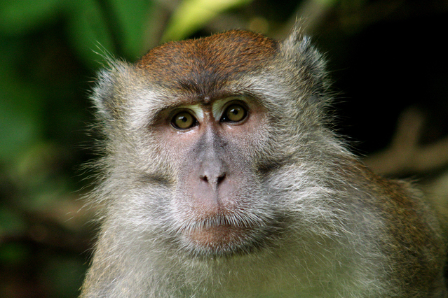

## Hi!

I am 4th year astronomy student at UBC. My research interests are in Cosmology and Galactic magentism. I worked on a polarimetry data simulator for the upcoming Candian Galactic Emission Mapper (CGEM). I a currently a research fellow at the Canadian Institue of Theoretical Astrophysics. I am researching the application of huperspectral line tools (ROHSA) to Rotation Measure data.  

### More:

-[Research Experience](./research.html)

