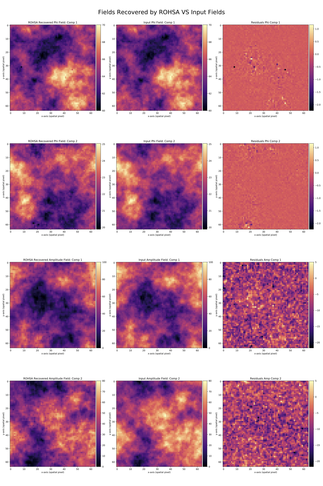
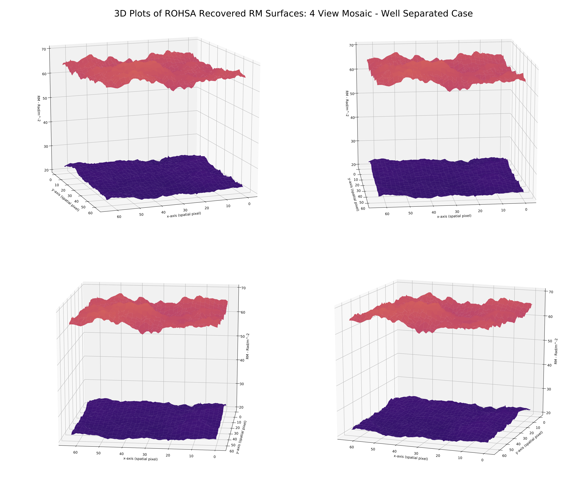

# Research Experience

* * *

## Mapping Galactic Magentic Fields Using RMtools and ROHSA
Canadian Institute of Theoretical Astrophysics| Research Fellow | May 2021 - August 2021

* Synthesized polarisated observation data using Python
* Modified FORTRAN code to work with Rotation Measure data cubes
* Assesed the performance of the modified ROHSA tool on RMcleaned data

[Figure 1: Plots of two RM components in the IC342 recovered by ROHSA](https://artemsdavydov.github.io/assets/img/rohsafirstresult.pdf)

[Figure 2: Plots of ROHSA recovered RM profiles VS input profiles in a two well separated component case](https://artemsdavydov.github.io/assets/img/rohsaresults.pdf)

[Figure 3: 3D Surface Plot of the ROHSA recovered RM profiles](https://artemsdavydov.github.io/assets/img/rmprofiles3d.pdf)

## Setting Systematic Error Requirements on the CGEM Telescope Using B Mode Contamination Criteria
University of British Columbia| Undergraduate Thesis | Winter 2020 

* Calculated power spectra of maps recovered from data streams that include realistic errors in phase and gain. 
* Investigated the instrumental error’s BB power contribution in CGEM maps extrapolated to the CMB observation window of approximately 100GHz. 
* Compared the expected CMB BB power level given an r value with the instrumental error’s power BB contribution  to place a restriction on allowed error in phase and gain. 

[Thesis PDF](https://artemsdavydov.github.io/assets/thesis/artem_thesis.pdf)

## Simulating the Polarised 10GHz Sky as Seen by The Canadian Galactic Emission Mapper (CGEM)
University of British Columbia| Summer Undergraduate Research NSERC | June 2020 - August 2020

The Canadian Galactic Emission Mapper (CGEM) is a planned radio telescope that will survey the upper hemisphere polarized  10GHz sky. The main science goal of CGEM is to improve our galactic foreground modelling abilities  in support of the CMB B mode search.
* Coded an observation simulator in Python to support design decisions of CGEM and validate the chosen scan strategy. 
* Produced time series data of Stokes I, Q, and U along with the corresponding rotation angles of the telescope with respect to the CMB frame given a scan strategy. 

## IoT Gas and Temperature Monitoring Interface of a Low Temperature Pyrolysis Reactor for the Production of Biochar
Langara College| Engineering Transfer Capstone Paper Co-Author | Spring 2019

* Created a local webpage and server that display and store live sensor readings and statistics read from the monitor.
* Co authored a paper summarizing the findings of the collaboration which was published by IEEE. 

 
[IEEE XPlore Publication](https://ieeexplore.ieee.org/document/8936257)

[back](./)

